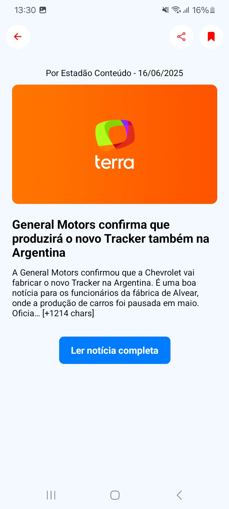
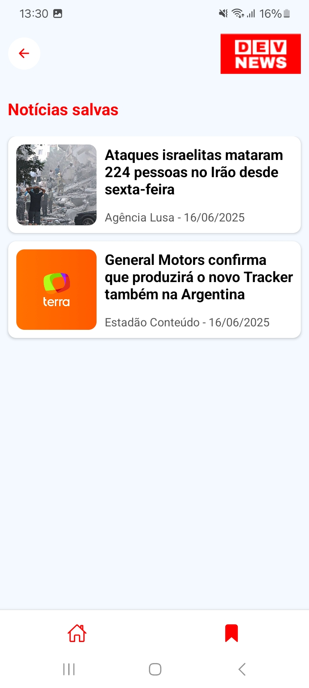

# 📰 DevNews 

O **devNews** é um aplicativo mobile desenvolvido com **React Native** e **Expo** que permite ao usuário acompanhar as últimas notícias organizadas por categorias, realizar buscas por palavra-chave e salvar notícias favoritas para leitura posterior e compartilhar com quem quiser.

## 📲 Demonstração
Veja abaixo algumas telas do aplicativo devNews em funcionamento:

<p align="center">
  
  
  
  
</p>

## 📱 Funcionalidades

- Listagem de notícias por categoria
- Busca de notícias por palavra-chave
- Visualização de notícia em tela detalhada
- Carousel com destaques (Top Headlines)
- Favoritar e desfavoritar notícias
- Visualização de notícias favoritas
- Scroll infinito para carregar mais notícias
- Compartilhamento de notícias

## 🚀 Tecnologias

- **React Native + Expo** para facilitar o desenvolvimento e testagem em múltiplos dispositivos.
- **React Navigation** com `expo-router` para navegação simplificada entre telas.
- **AsyncStorage** para armazenamento local das notícias favoritas.
- **FlatList com scroll infinito** permite carregamento dinâmico das notícias conforme o usuário rola a tela.
- **NewsAPI** integração com a API para obter notícias atualizadas.
- **SafeAreaView com edges** para garantir o uso correto do espaço em dispositivos com notch.

## 🛠️ Como executar o projeto

### Pré-requisitos

- [Node.js](https://nodejs.org/)
- [Expo CLI](https://docs.expo.dev/get-started/installation/)
- Um editor como [VS Code](https://code.visualstudio.com/)

1. Clone o repositório

   ```bash
   git clone https://github.com/lucasofaria/devNews.git
   cd devNews
   ```

2. Instale as dependências

   ```bash
   npm install
   ```

3. Adicione suas vaiáveis de ambiente
No arquivo app.config.js, você precisa adicionar sua chave da NewsAPI em extra.newsApiKey. Exemplo:
   ````bash
   extra: {
      newsApiKey: "SUA_API_KEY_AQUI"
   }
   ````
Você pode obter uma chave gratuita em https://newsapi.org.

4. Inicie o app

   ```bash
   npx expo start
   ```
Escaneie o QR code com o aplicativo do Expo Go ou use um emulador Android/iOS.

## 📌 Observações

- O app está otimizado para Android, mas também funciona em iOS.
- A imagem de destaque pode não carregar caso a notícia não contenha urlToImage.
- A NewsAPI possui limites de requisição na versão gratuita.
